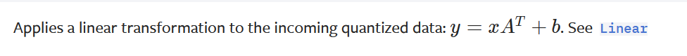

---   
layout: post   
title:  "pytorch学习笔记"   
date:   2025-1-14 10:55:54 +0800   
categories: jekyll update   
---   
#### 1. 前言   
最开始其实学的是tensorflow，但是这玩意的api读起来有点要命，而且版本不兼容问题太严重了，要写模型的话很难参考网上的代码。   
   
[pytorch](https://pytorch.org/)这部分问题就好得多，而且写图神经网络还有[pyg](https://pytorch-geometric.readthedocs.io/en/latest/)可以用，挺不错的，后来就在师兄推荐下学了这个。    
   
为了防止自己遗忘一些方法和常见的错误，所以写了这篇笔记   
不过既然作为一个机器学习的函数库，只写此库本身的内容显得有些单薄，所以本文章可以视为一个机器学习与pytorch学习笔记的结合体。不过并不涉及机器学习本身算法的内容——这部分应该会单独写一篇      
   

内容大致分为两部分：常见的数据处理注意点与在实验过程中可能产生的错误   
   
#### 2. 数据处理注意点   
- 让模型拿到你处理完的数据就能跑   
这个主要是为了提升训练速度的。如果每次模型在跑之前都需要处理一遍你的数据，那模型的训练速度肯定会大打折扣   
~~为什么这么基本的东西也要写，因为我干过~~    

- 能标准化的尽量标准化   
在提取完数据后，注意看一眼数据的分布，如果分布范围极大，记得进行标准化，提升模型收敛速度   
   
- 尽量存一份原始数据   
做特征提取的时候尽量先存一份基本未经过处理的数据。这样可以防止每次改变特征提取方式的时候，重新提取一遍所有数据。而存下来基本未经处理过的数据之后就可以直接对着数据调整   
比如改变标准化方式的时候，如果你有一份原始数据，你就可以直接跑你新的标准化算法。但是如果你只有一份原先的标准化算法产生的数据，就需要花很多时间再次提取一遍原始数据，效率很低   
   
- 尽量使用pickle、pandas等库本地化预处理后的数据   
没啥说的，用库中的函数直接提取数据肯定比存在txt文件里方便多了，或许由于实现方式的原因还能快一点   
~~没错这个我也干过~~   

- 关于数据处理的时间问题
其实数据预处理的作用就是减小数据处理过程中的时间瓶颈对模型训练周期的影响。因此重点在于找到产生时间瓶颈的位置，并考虑采取一定方式将其运行次数减到最少   

- 数据分布极度不均匀
如果是单纯的数字的话，可以考虑使用SMOTE方法进行重采样。相比起重采样，上采样和下采样使用的范围会更广一点，不过需要注意数据量是否合适

- 后话
机器学习结果的好坏与所提取的数据内容的好坏有直接关系，不可忽视数据处理这部分的重要性。   

#### 3. 可能产生的错误    

- permute()函数   
使用此函数进行维度交换时，应该确保维度调整之后的内容不仅仅维度符合要求，每个维度上的内容也应该符合你的要求，需要打印出来检查一下   

- to(device)函数
可以将数据搬到gpu或者cpu上，注意此处搬的过程存在一定的时间开销。如果batchsize很小或者数据量本身就不大的话，把数据从cpu搬到gpu上的过程反而可能成为时间瓶颈   
   
- 使用minibatch加速训练时
在写模型的时候一定要注意，在gpu上训练肯定是要用minibatch的，也就是说你的forward函数一定要写的能够支持对**一组**数据的训练   
~~这个也干过~~   
    

- 数据处理时使用切片   
这个方法本身没有问题，但是容易出现把不同部分的数据切到同一个部分中的问题。虽然也是个基础问题，但是很容易错——一定要数明白你列表中哪部分到哪部分是什么数据，实在搞不清楚就输出出来看看。    
  
- 在模型最后的全连接部分只加一个全连接层   
全连接层实现的函数是   
   
只有一个全连接层相当于认为输出与你提取的特征是线性关系，这大概率是不可能的。连个三层就差不多了   
~~这个还干过~~   
